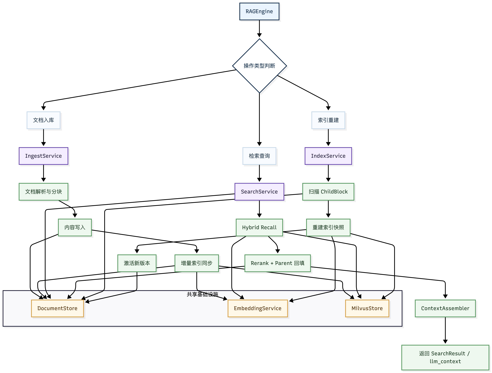

# ModularRagEngine

面向 Python 后端系统的分层 RAG 引擎，提供统一文档接入、分层切块、索引构建、混合检索与上下文组装能力。

`ModularRagEngine` 不把 RAG 当作一次性脚本，而是把它收敛成可替换、可组合、可维护的后端能力。默认链路围绕 `PostgreSQL + Milvus + Embedding Service + Reranker` 构建，同时保留了清晰的端口边界，方便在工程内替换底层实现。

<p align="center">
  
</p>

## 为什么是这个仓库

`ModularRagEngine` 关注的是工程化 RAG，而不是演示型 RAG。

- 对外只暴露一个稳定入口：`RAGEngine`
- 文档接入支持“文件直读”和“宿主侧预解析”两条路径
- chunking 不是黑盒：先走 Markdown 结构切分，失败时退回语义切分，再补一层长度兜底
- 检索链路不是单一向量召回：默认使用 Milvus dense + BM25 sparse 混合检索
- namespace、index、active version 都是显式模型，而不是隐式状态
- 搜索结果不止返回 hits，还会组装父块上下文，直接产出 `llm_context`

## 核心特性

- 统一入口：`ingest_files()`、`ingest_documents()`、`rebuild_index()`、`delete_index()`、`search()`
- 分层 chunking：`ParentChunk` 用于上下文回填，`ChildBlock` 用于向量检索
- 中英文分路：自动识别主语言，分别走不同的切句规则和不同的 Milvus collection
- 混合检索：支持 dense + sparse 融合，融合策略支持 `weighted` 与 `rrf`
- 语义重排：默认接入 cross-encoder reranker，对召回结果二次排序
- 可控过滤：检索过滤条件在 DTO 层标准化，避免魔法字典四处传递
- 评测脚本：内置检索评测 CLI，可对真实文档执行 Recall / MRR / nDCG 统计

## 安装

默认运行链路依赖若干可选包，推荐直接安装完整开发环境：

```bash
python -m pip install -e ".[dev,extras]"
```

如果只需要基础依赖：

```bash
python -m pip install -e .
```

如果依赖已经由外部环境管理，也可以跳过依赖安装：

```bash
python -m pip install -e . --no-deps
```

需要注意的运行时边界：

- 默认 `RAGEngine()` 会装配 `SemanticReranker`，未安装 `sentence-transformers` 时无法启用默认重排器
- 处理 `csv` 需要 `pandas`
- 处理 `doc`、`docx`、`html`、`htm` 需要 `markitdown`
- 处理 `pdf` 需要 `docling`；若走 OCR 回退，还需要 OCR 提供方配置
- 若使用 OpenAI 或 Ollama embedding，需要安装对应依赖并配置 `.env`

## 运行前准备

默认链路依赖以下外部服务：

- PostgreSQL：保存文档、chunk、index 元数据
- Milvus：保存检索 entry 与向量索引
- Embedding 服务：支持 `ollama` 或 `openai`
- OCR 服务：按配置选择 `paddle` 或 `openai`

以 `.env.example` 为模板创建 `.env`，至少需要确认以下配置组：

- `POSTGRES_*`
- `MILVUS_*`
- `EMBEDDING_PROVIDER` 与对应的 provider 配置
- `OCR_PROVIDER` 与对应的 provider 配置
- `RERANKER_*`

## 快速开始

### 1. 创建引擎

```python
from ModularRagEngine import RAGEngine

engine = RAGEngine()
```

### 2. 写入已解析文档

```python
from ModularRagEngine.application.dto import IngestDocumentsRequest, InputDocument

engine.ingest_documents(
    IngestDocumentsRequest(
        namespace_key="legal-case-001",
        documents=[
            InputDocument(
                external_doc_id="doc-001",
                file_name="case.md",
                file_type="md",
                parsed_md_content=(
                    "# Case Background\n\n"
                    "The dispute focuses on liquidated damages.\n\n"
                    "## Judgment\n\n"
                    "The court supports the plaintiff's claim."
                ),
                metadata={"language": "en"},
            )
        ],
    )
)
```

### 3. 执行检索

```python
from ModularRagEngine.application.dto import SearchRequest

result = engine.search(
    SearchRequest(
        namespace_key="legal-case-001",
        query="liquidated damages",
        top_k_recall=8,
        top_k_rerank=5,
        top_k_context=3,
        filters={"language": "en"},
    )
)

print(result.llm_context)
```

### 4. 从文件直接入库

```python
from ModularRagEngine.application.dto import IngestFilesRequest

engine.ingest_files(
    IngestFilesRequest(
        namespace_key="runtime-guide",
        file_paths=["/absolute/path/project_runtime_guide.md"],
        use_ocr=False,
    )
)
```

### 5. 重建索引

```python
from ModularRagEngine.application.dto import RebuildIndexRequest

engine.rebuild_index(
    RebuildIndexRequest(
        namespace_key="legal-case-001",
        retrieval_text_policy="content_only",
    )
)
```

## API 概览

`RAGEngine` 当前公开的核心 API：

- `RAGEngine.ingest_files()`
- `RAGEngine.ingest_documents()`
- `RAGEngine.rebuild_index()`
- `RAGEngine.delete_index()`
- `RAGEngine.search()`

请求与响应模型位于 `application/dto.py`。

## namespace 与索引语义

这个仓库把 namespace 和 index 当作显式状态管理，而不是隐藏在调用侧约定里。

- 仅传 `namespace_key`：允许创建或复用 namespace
- 仅传 `namespace_id`：只解析已有 namespace，不隐式创建新 key
- 同时传 `namespace_id` 与 `namespace_key`：二者必须指向同一个 namespace，否则报错
- `ingest_*` 默认会把文档同步到当前 active index
- `rebuild_index()` 会生成新的 index version，并切换 active index
- `delete_index()` 用于删除指定索引

## 支持的输入类型

`ingest_files()` 当前支持以下文件类型：

- 纯文本：`md`、`txt`
- 结构化文本：`json`、`csv`
- Office / Web：`doc`、`docx`、`html`、`htm`
- 文档文件：`pdf`
- 图片文件：`jpg`、`jpeg`、`png`、`bmp`、`tiff`、`tif`

默认转换策略：

- `md` / `txt`：按文本读取
- `json`：格式化为 Markdown 代码块
- `csv`：转换为 Markdown 表格
- `doc` / `docx` / `html`：通过 `markitdown` 转为 Markdown
- `pdf`：优先 `docling`，失败时按需回退 OCR
- 图片：直接走 OCR 转 Markdown

## 检索链路

默认搜索路径如下：

1. 解析 namespace，读取 active index
2. 生成 query embedding
3. 在 Milvus 上执行 dense + sparse 混合检索
4. 对召回结果执行 rerank
5. 回填父块上下文，可选扩展 `parent_window`
6. 输出 `hits`、`contexts` 与可直接给 LLM 的 `llm_context`

chunking 路径如下：

1. 检查文档是否存在明确 Markdown 标题
2. 有标题时，优先按标题结构切分
3. 无标题时，退回基于 embedding 的语义切分
4. 对超长分片再做长度兜底
5. 生成 `ParentChunk`
6. 继续切分为 `ChildBlock`

## 检索评测

仓库内置了真实链路评测脚本：

```bash
python -m ModularRagEngine.utils.retrieval_eval \
  --doc /absolute/path/project_runtime_guide.md \
  --ks 1,3,5
```

也可以通过 console script 调用：

```bash
rag-retrieval-eval \
  --doc /absolute/path/project_runtime_guide.md \
  --ks 1,3,5
```

默认会在评测完成后清理 PostgreSQL / Milvus 中产生的临时数据；如需保留现场，可追加：

```bash
rag-retrieval-eval \
  --doc /absolute/path/project_runtime_guide.md \
  --ks 1,3,5 \
  --keep-artifacts
```

## 项目结构

```text
universal_rag_chunker/
├── api/                        # 对外 Facade，暴露 RAGEngine
├── application/                # 应用编排、DTO、namespace 解析、检索服务
├── domain/                     # 领域模型、异常、常量、端口定义
├── infrastructure/             # 基础设施适配器：loader、chunker、Milvus、reranker
├── infrastructure/persistence/ # PostgreSQL 连接、建表、mapper、repository
├── utils/                      # OCR、embedding、评测工具
├── images/                     # README 资源
├── composition.py              # 默认依赖装配入口
├── config.py                   # 运行时配置入口
├── pyproject.toml              # 包元数据与工具配置
└── __init__.py                 # 包根导出
```

## 开发

建议至少完成以下检查：

```bash
python -m compileall -q .
ruff check .
mypy .
```

如果新增或调整 README 中描述的能力，建议同时更新：

- `docs/stage1_chunking_explained.md`
- `docs/storage_schema_design.md`
- `.env.example`

## 贡献与许可

欢迎通过 issue 或 pull request 讨论接口设计、检索策略和基础设施适配方式。